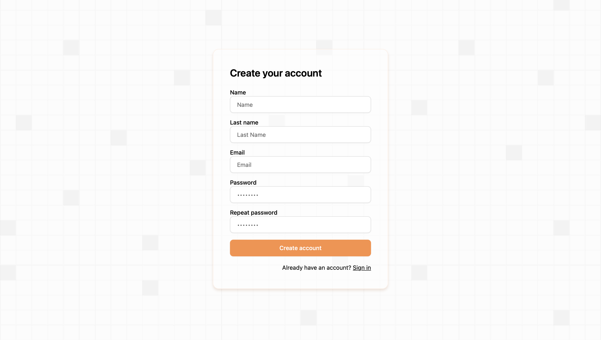
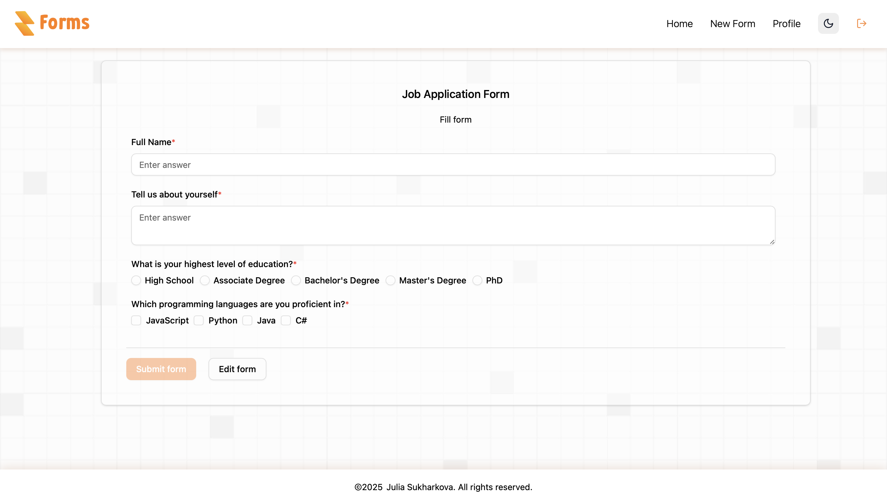
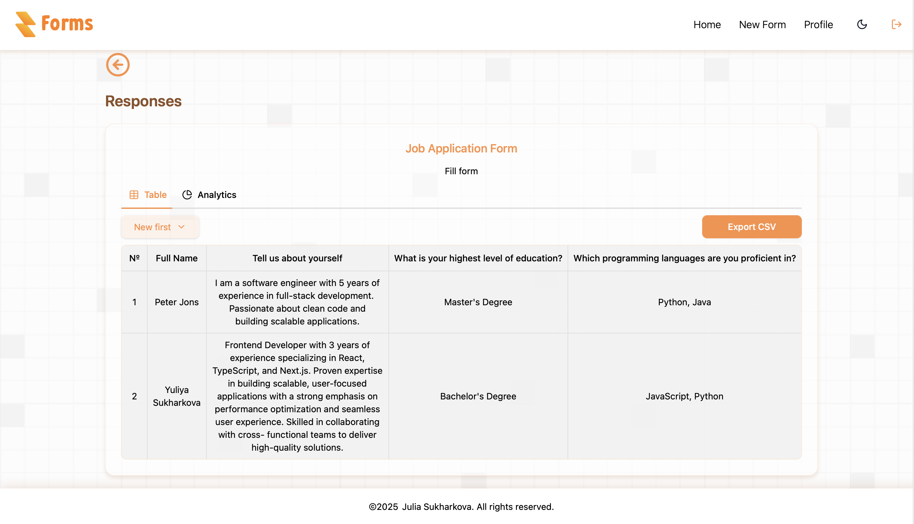
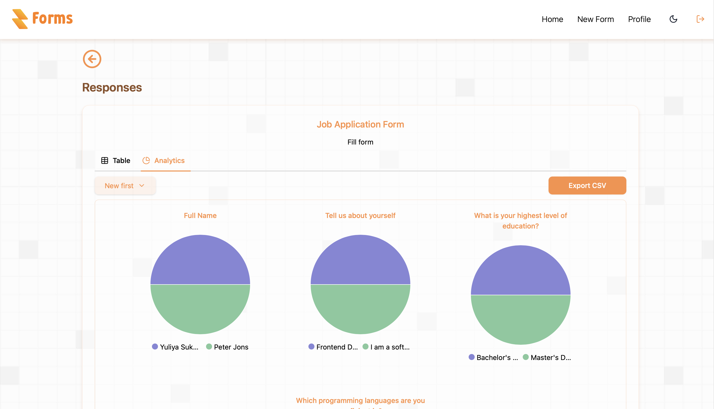

# Forms: Platform for creating surveys and questionnaires


> Welcome to **Forms**, a powerful web application for creating, managing, and analyzing forms, inspired by Google Forms. Built with React and TypeScript, this project showcases my skills as a Frontend Developer, featuring drag-and-drop form building, real-time analytics, form timers, and secure authentication.

🔗 [Link to the project](https://github.com/JuliaSukharkova/forms)

---

## 🚀 Features

- **🎯 Drag & Drop Form Builder**: Create dynamic forms on `FormEditorPage` using `@dnd-kit` (text, dropdowns, checkboxes, multi-select, time pickers).
- **⏱️ Form Timer**: Track and limit form completion time on `FormSubmitPage` with a custom `Timer` component and warnings.
- **📝 Form Submission**: User-friendly forms with validation using React Hook Form on `FormSubmitPage`.
- **📊 Analytics & CSV Export**: Visualize responses with Recharts (pie charts) on `FormResponsesPage` and export to CSV.
- **🔍 Search & Sort**: Search forms by title and sort by date or alphabetically with `SortMenu` on `MainPage`.
- **🌓 Light/Dark Themes**: Theme switching with Tailwind CSS, auto-adapting to `prefers-color-scheme`.
- **📱 Responsive Design**: Optimized for desktops, tablets, and mobile devices.
- **👤 User Profile**: Upload avatars, edit details, and change passwords on `ProfilePage`.
- **🔐 Authentication**: Registration and login with validation on `SignUpPage` and `SignInPage` via React Hook Form and Firebase Authentication.
- **✅ Form Validation**: Robust validation for required fields, emails, and custom rules.
- **☁️ Data Storage**:
  - **Firebase**: User authentication and profile data.
  - **Supabase**: Form creation and responses in PostgreSQL.

---

## 📸 Screenshots

| Sign In |  Sign Up  |
|-------------|-------------|
|  |  |
| User Profile | Main Page
| | |
|   |  |
| Form Editor | Form Submission |
| | |
|  |  |
|Analytic Responses | Analytic Charts |
|                  |                 | 
|  |  |


---

## 🛠️ Tech Stack

- **Frontend**: React, TypeScript, Vite
- **UI**: Tailwind CSS, shadcn/ui, Radix UI
- **State Management**: React Context, useState
- **Forms & Validation**: React Hook Form, Yup
- **Analytics**: Recharts
- **Authentication**: Firebase Authentication
- **Database**: Supabase (PostgreSQL)
- **Tools**: Git, ESLint, Prettier
- **Deployment**: GitHub Pages

---

## 📦 Installation & Setup

1. **Clone the repository**:
   ```bash
   git clone https://github.com/JuliaSukharkova/forms.git
   cd forms
   ```

2. **Install dependencies**:
   ```bash
   npm install
   ```

3. **Set up environment variables**:
   - Create a `.env` file in the root directory based on `.env.example` (create it with the following template):
     
     ```plaintext
     VITE_FIREBASE_API_KEY="your_firebase_api_key"
     VITE_FIREBASE_AUTH_DOMAIN="your_firebase_auth_domain"
     VITE_FIREBASE_PROJECT_ID="your_firebase_project_id"
     VITE_FIREBASE_STORAGE_BUCKET="your_firebase_storage_bucket"
     VITE_FIREBASE_MESSAGING_SENDER_ID="your_firebase_messaging_sender_id"
     VITE_FIREBASE_APP_ID="your_firebase_app_id"
     VITE_FIREBASE_MEASUREMENT_ID="your_firebase_measurement_id"
     VITE_SUPABASE_URL="your_supabase_url"
     VITE_SUPABASE_ANON_KEY="your_supabase_anon_key"
     ```
   - Replace the placeholder values with your Firebase and Supabase credentials.

4. **Start the project**:
   ```bash
   npm run dev
   ```
   - Open the application in your browser at: [http://localhost:5173/](http://localhost:5173/)

---

## 🧠 Lessons Learned

- **Drag-and-Drop**: Mastered `@dnd-kit` for a flexible form builder on `FormEditorPage`.
- **Timer Implementation**: Built a `Timer` component to enhance UX on `FormSubmitPage`.
- **Analytics**: Leveraged Recharts to create interactive pie charts on `FormResponsesPage`.
- **Performance**: Optimized rendering with `useMemo` and lazy loading for large forms.
- **Integrations**: Gained expertise in Firebase Authentication and Supabase for secure data management.

---

## 🌟 Why This Project?

This project demonstrates my ability to:
- Build scalable, type-safe React applications with TypeScript.
- Create intuitive, responsive UIs with Tailwind CSS and modern libraries.
- Implement advanced features like form timers, drag-and-drop, and analytics.
- Integrate third-party APIs (Firebase, Supabase) for authentication and data storage.
- Deliver optimized, production-ready code with clean architecture.

---

## 📫 Contact

- **Email**: yulk.b53@gmail.com
- **LinkedIn**: [Julia Sukharkova](https://www.linkedin.com/in/juliasukharkova/)
- **GitHub**: [github.com/JuliaSukharkova](https://github.com/JuliaSukharkova)
